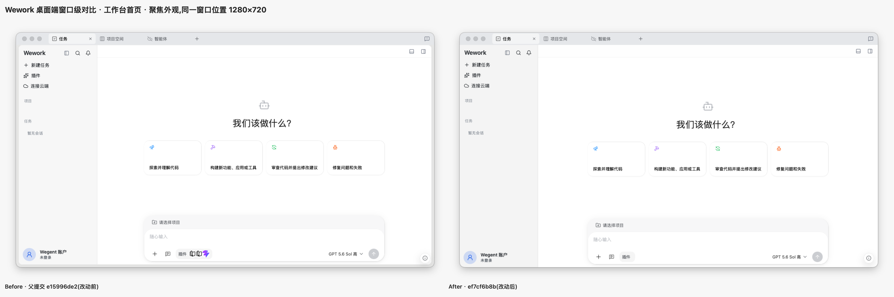
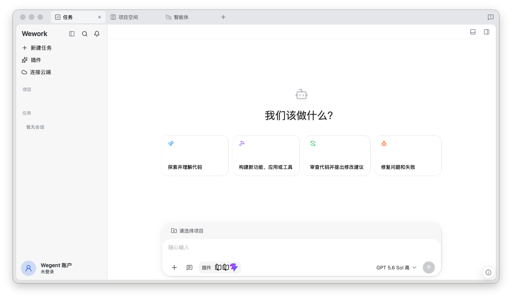
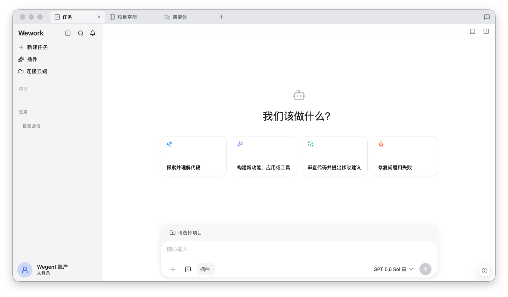
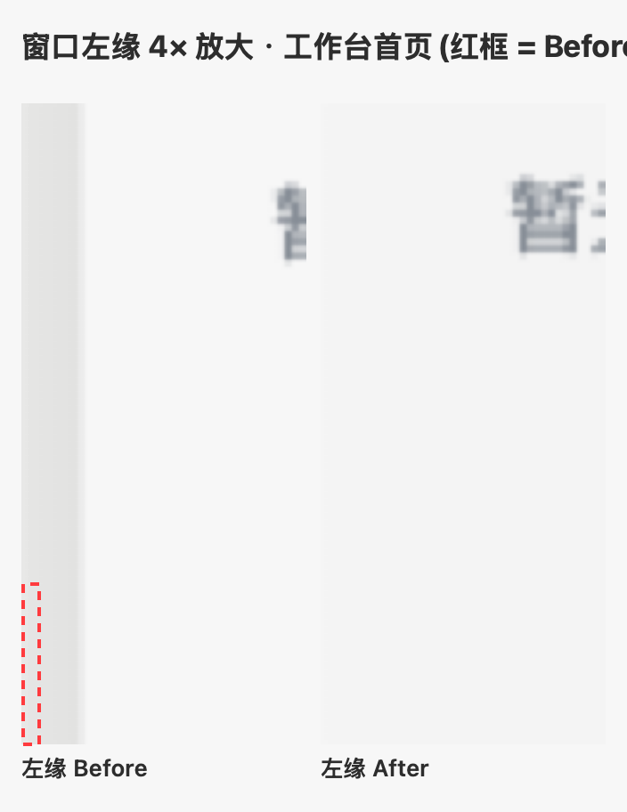
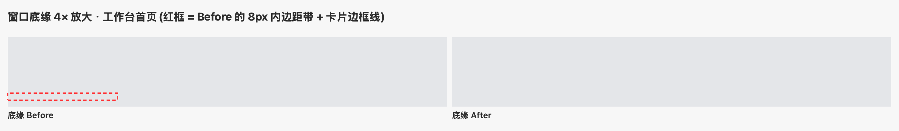
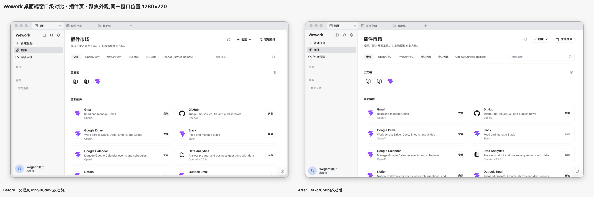
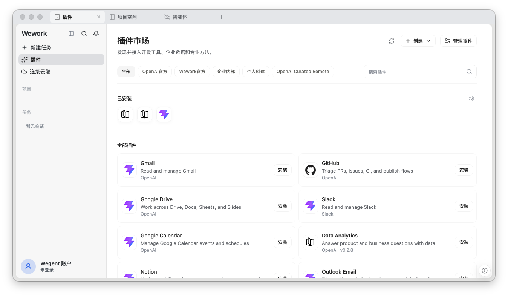
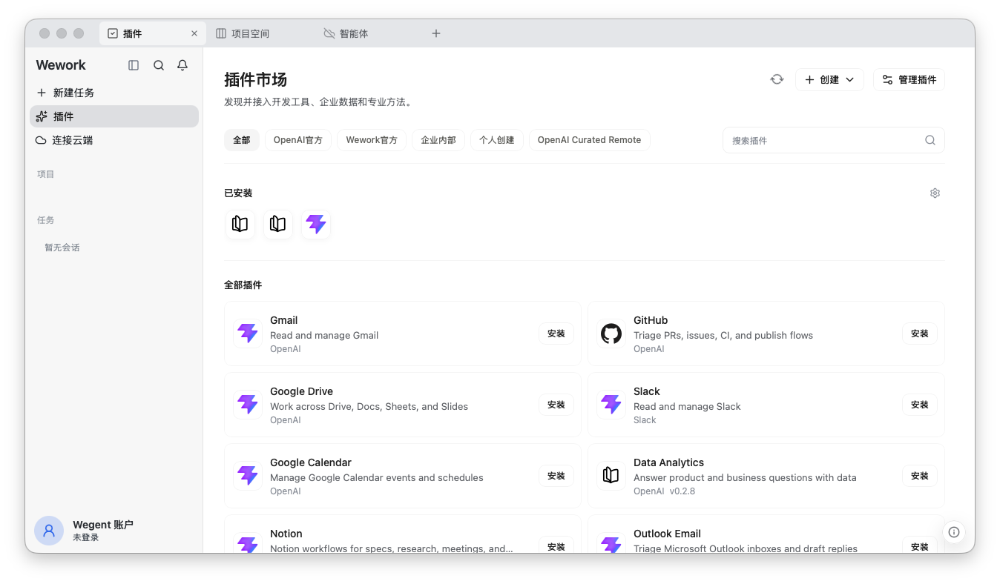
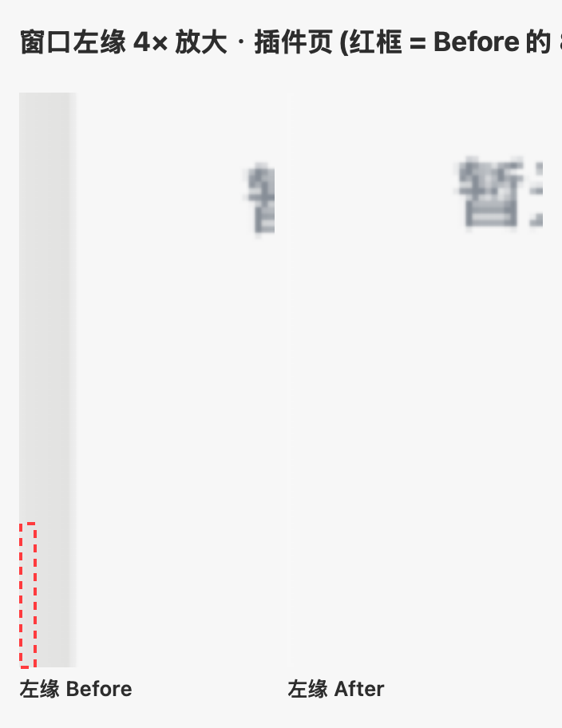
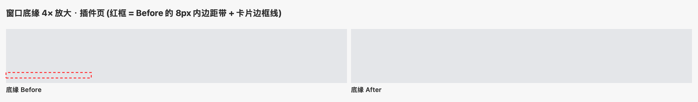

# Issue: 移除 Wework 桌面端主区多余的内部圆角与边距

> 状态:草稿,待审阅。分支已推送到 origin(fork);before/after 截图见下方证据目录。

## 问题描述

Wework 桌面端(Tauri)主区在顶部标签栏下方存在一层"浮层卡片"效果:内容左右与底部各留约 `8px` 内边距,并带有 `rounded-xl` 圆角、边框和阴影。在 macOS 上,这层内圆角与系统窗口自身的圆角叠加,视觉上出现双重圆角和一圈灰边,显得不协调。Web 端(浏览器)并没有这层 surface 内边距。

## 根因

桌面内容容器(`app-view-surface`)在标签页拆分(#2358)时引入,并在 #2453 中统一应用到任务页与插件、云端工作等功能页,以保持同一标签页内左侧栏位置稳定:

- `wework/src/styles/globals.css` 中 `.app-view-surface` 定义 `margin: 0 0.5rem 0.5rem`(左右+底部 8px);
- `wework/src/App.tsx` 的 `WorkspaceTabSurface` 在 `isTauriRuntime()` 时给 workbench / auxiliary surface 追加 `app-view-surface overflow-hidden rounded-xl border border-border/60 bg-background shadow-[...]`;
- macOS 窗口本身为 `decorations: true` + `transparent: true` + `windowEffects: sidebar`(毛玻璃),窗口四角圆角是平台原生行为,不在本次范围内。

## 改动

- **`wework/src/App.tsx`**:移除 native 端 workbench / auxiliary surface 上的 `app-view-surface` + 圆角/边框/阴影包裹,恢复为全出血(`h-full`)容器;web 端代码路径不变。
- **`wework/src/App.apps.test.tsx`**:断言改为 surface 仅含 `h-full`,且逐类断言不包含 `app-view-surface` / `rounded-xl` / `border`;新增断言锁定 `AppIframe` 仍保留 `app-view-surface`(云端应用 iframe 为 web/native 一致行为,刻意保留)。
- **`docs/zh|en/wework/workbench.md`**:更新为"标题栏下方全宽桌面内容容器",并说明页面仍可绘制各自内部外观。

## 截图对比(窗口级)

> **前置说明(焦点状态)**:macOS 窗口在**聚焦**时,头部(标题栏/标签栏)与主区容器底色存在色差,内层卡片的 8px 边距与圆角才明显可见;窗口**失焦**时两者底色一致,做不做 full-bleed 看起来都协调。因此证据统一取**聚焦外观**:前后均为真实 Tauri 会话、同一窗口位置 1280×720 的窗口级捕获(含 macOS 原生标题栏与交通灯),渲染状态一致、可直接横向对比。

### 工作台首页

窗口级并排对比(Before 左 / After 右):

Before / After 原图(窗口级):

| Before(父提交 `e15996de2`) | After(`ef7cf6b8b`) |
| --- | --- |
|  |  |

窗口左缘 4× 放大:Before 红框内为 8px 内边距带(窗口底色透出),After 侧栏贴左缘:

窗口底缘 4× 放大:Before 红框内为 8px 内边距带 + 卡片边框线,After 内容贴底缘:

### 插件页

窗口级并排对比(Before 左 / After 右):

Before / After 原图(窗口级):

| Before | After |
| --- | --- |
|  |  |

窗口左缘 / 底缘 4× 放大:

像素采样(after):侧栏贴左缘/底缘、主区贴右缘/底缘,无内层卡片边框;顶部标签栏贴边。四角剩余圆角为 macOS 窗口自身形状。完整采样数据见 [qa-record.md](review-evidence-remove-native-surface-inset/qa-record.md)。

## 验证

- 完整单元测试:`pnpm --filter wework test` — 307 files / 2992 tests 全部通过;`tsc -b`、eslint、prettier 通过。
- 真实 Tauri 验证:`ai:verify` 隔离会话(before 基于父提交 `e15996de2`,after 基于 `ef7cf6b8b`),工作台首页与插件页均确认全出血;窗口级截图与像素采样见 [qa-record.md](review-evidence-remove-native-surface-inset/qa-record.md)。

## 分支

- 分支:`fix/wework-remove-native-surface-inset`(已推送到 origin fork `qwertyerge/Wegent`,基于最新 upstream main `e15996de2`)
- 提交:`fix(wework): remove native desktop surface inset`
- 创建 PR 链接:https://github.com/qwertyerge/Wegent/pull/new/fix/wework-remove-native-surface-inset

## 后续(可选)

- `AppsPage` 在独立工作区窗口(`workspace-*`)中的 6px 内衬背景会从 `bg-background` 变为标题栏灰,需一次分离窗口视觉确认;如不理想,可让 AppsPage 自绘 `bg-surface`。
- macOS 窗口四角圆角若要完全消失,需改无边框窗口(`decorations: false` + 自定义形状),会丢失原生阴影/标题栏,默认不建议。
